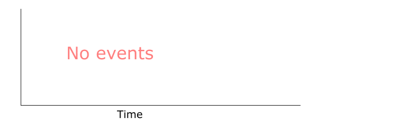

# kotlin-coroutine-rate-limiter

Reference implementations of a rate- and interval limiter, using kotlin coroutines

## Rate limiter
Just Like Guava RateLimiter, a "soft" throughput allowed. No spikes at any point.

## Interval limiter
For every interval given, allow any form of throughput until the limit is reached. Then block or delay.

## Goals

Primary Goals:
* Zero java deps.  
To be able to make it work for Kotlin multi platform / stdlib / kotlinx.coroutines
* Same API as Guava.  
It's the defacto standard implementation for rate limiting, so far as I know
* Fast.
* No scheduler or executor.  
rely entirely on calculated delay and kotlinx.coroutines#delay for scheduling
* Testable.

Secondary goals:
* Stats.  
Pluggable stats would be nice. Registering callbacks of some kind? Not to pollute the API with direct implementations. Use actor-counter?

